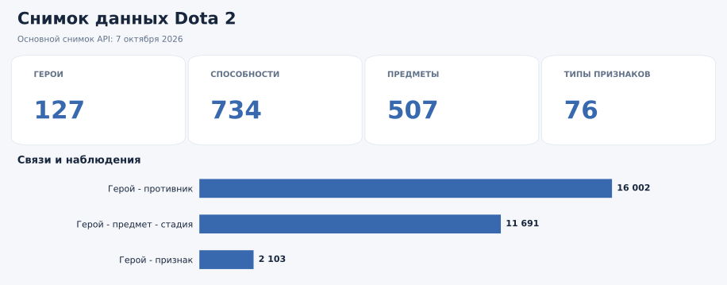
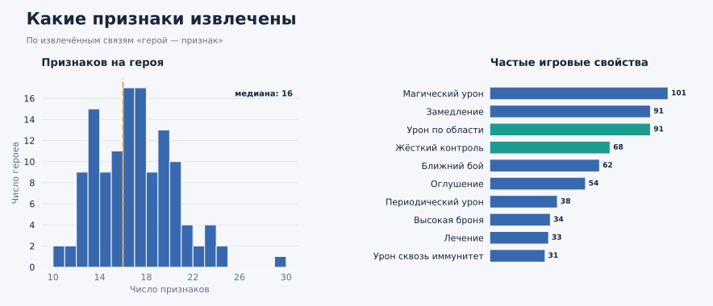
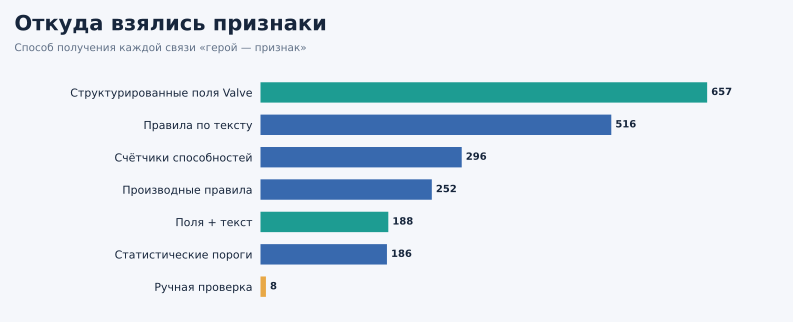
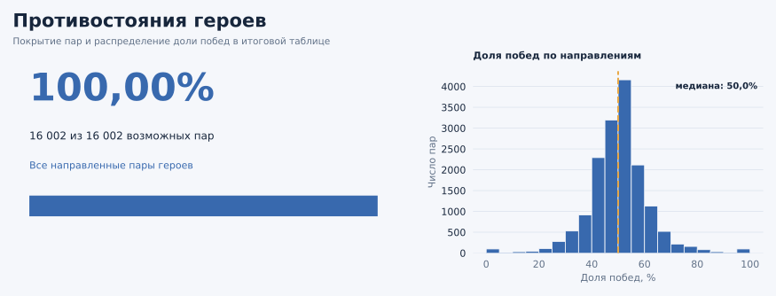
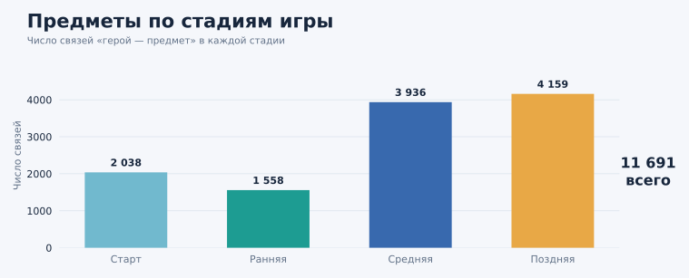

# Dota 2: данные для графа знаний о контрпиках

Снимок на **7 октября 2026 года** · источники: [Valve](https://www.dota2.com/datafeed/herolist?language=english) и [OpenDota](https://api.opendota.com/api/heroes) · подготовлены сущности и связи для будущего графа знаний.

## Датасет

| Таблица | Объём | Содержание |
| --- | ---: | --- |
| [`heroes.parquet`](data/final/heroes.parquet) | **127** | Герои и их характеристики |
| [`abilities.parquet`](data/final/abilities.parquet) | **734** | Способности с привязкой к героям |
| [`items.parquet`](data/final/items.parquet) | **507** | Предметы и их свойства |
| [`hero_features.parquet`](data/final/hero_features.parquet) | **2 103** | Связи «герой — признак», **76** уникальных признаков |
| [`hero_feature_matrix.parquet`](data/final/hero_feature_matrix.parquet) | **127 × 76** | Значения признаков для каждого героя |
| [`matchups.parquet`](data/final/matchups.parquet) | **15 968** | Направленные противостояния героев |
| [`hero_items.parquet`](data/final/hero_items.parquet) | **11 691** | Связи «герой — предмет — стадия игры» |
| [`hero_meta.parquet`](data/final/hero_meta.parquet) | **127** | Агрегированная статистика героев OpenDota |

## Признаки героев

## Противостояния и предметы

**Как читать данные:** положительный `normalized_advantage` в `matchups` означает преимущество героя из поля `hero_id`; это приблизительная оценка на основе агрегатов OpenDota. Отсутствующие 34 пары не подменяются нулями. Ноль в матрице признаков означает, что подтверждение свойства не найдено. Восемь ручных уточнений хранятся в `hero_features.parquet` с пометкой `derivation_method = manual` и сохраняются при пересборке.

Исходные ответы API сохранены в [`data/raw/`](data/raw/), результаты проверки — в [`data/reports/`](data/reports/). Граф знаний и расчёт контрпиков пока не построены.
