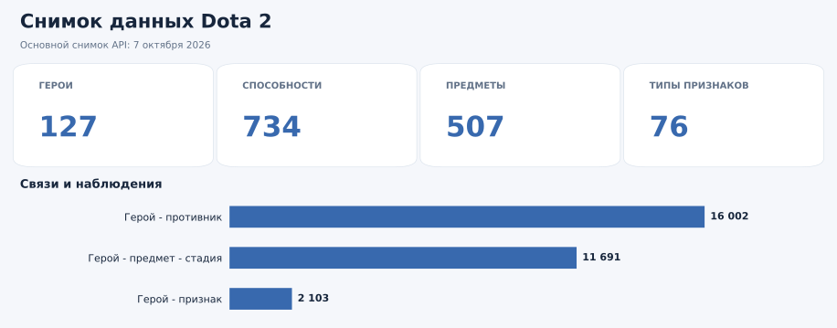
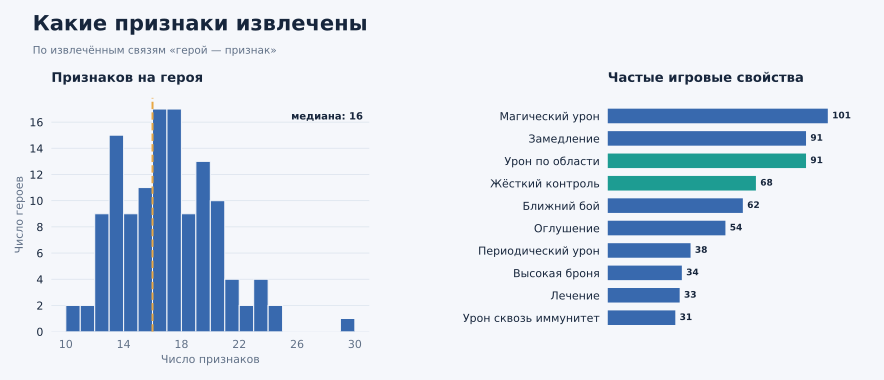
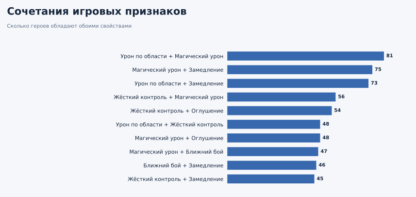
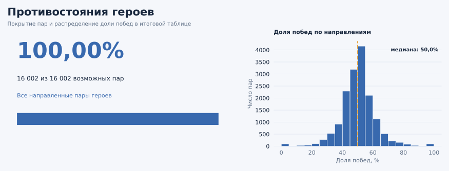
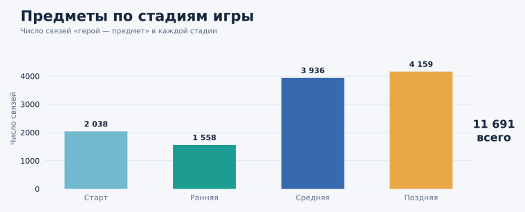
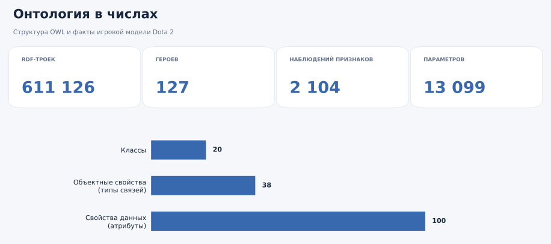
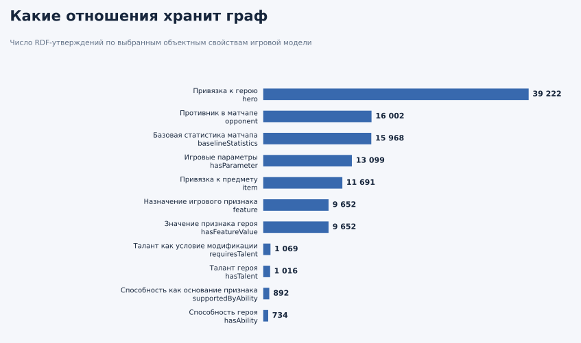
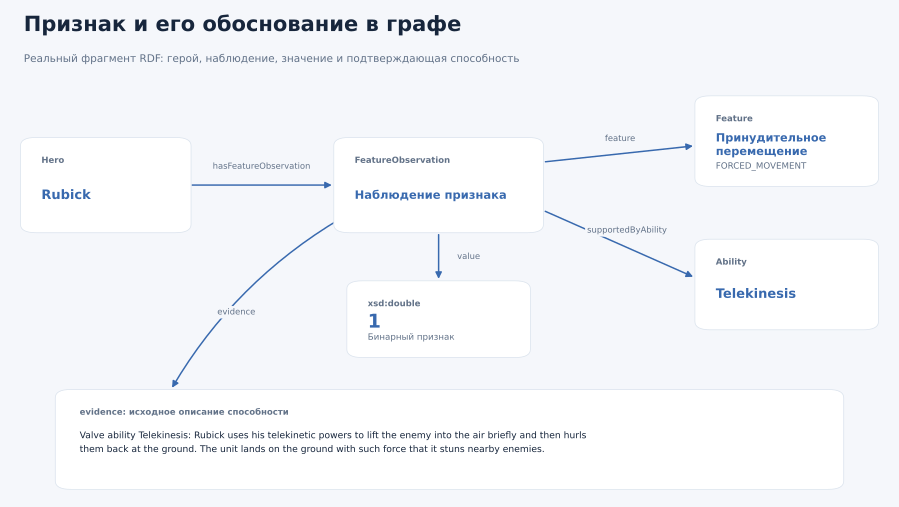

# Dota 2: граф знаний о контрпиках

Снимок игровых данных для графа знаний о контрпиках. Основные источники: [Valve](https://www.dota2.com/datafeed/herolist?language=english) и [OpenDota](https://api.opendota.com/api/heroes); ответы API получены **7 октября 2026 года**.

## Датасет

| Таблица | Объём | Содержание |
| --- | ---: | --- |
| [`heroes.parquet`](data/final/heroes.parquet) | **127** | Герои и их характеристики |
| [`abilities.parquet`](data/final/abilities.parquet) | **734** | Способности с привязкой к героям |
| [`items.parquet`](data/final/items.parquet) | **507** | Предметы и их свойства |
| [`hero_features.parquet`](data/final/hero_features.parquet) | **2 104** | Связи "герой - признак", **76** уникальных признаков |
| [`hero_feature_matrix.parquet`](data/final/hero_feature_matrix.parquet) | **127 x 76** | Значения признаков для каждого героя |
| [`matchups.parquet`](data/final/matchups.parquet) | **16 002** | Направленные противостояния героев |
| [`hero_items.parquet`](data/final/hero_items.parquet) | **11 691** | Связи "герой - предмет - стадия игры" |
| [`hero_meta.parquet`](data/final/hero_meta.parquet) | **127** | Агрегированная статистика героев OpenDota |

## Признаки героев

## Противостояния и предметы

## Онтология

[Игровая модель](ontology/game.ttl) | [Схема OWL](ontology/schema.ttl) | [Проверка](ontology/validation.json)

Граф связывает героев, способности, предметы, признаки и статистику противостояний.

| Структура | Количество |
| --- | ---: |
| Классы | **22** |
| Объектные свойства | **39** |
| Свойства данных | **77** |
| Значения матрицы, включая нули | **9 652** |
| Наблюдения рейтинговых интервалов | **1 016** |
| Параметры способностей и предметов | **8 997** |

Проверено: **OWL 2 DL**, **SHACL**, **4 SPARQL-запроса**.
